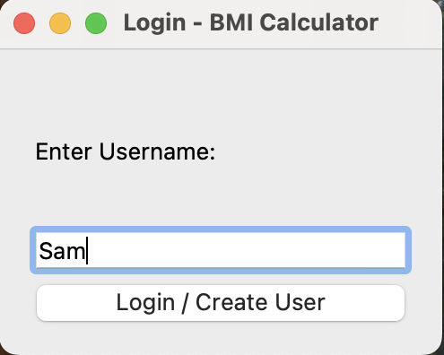
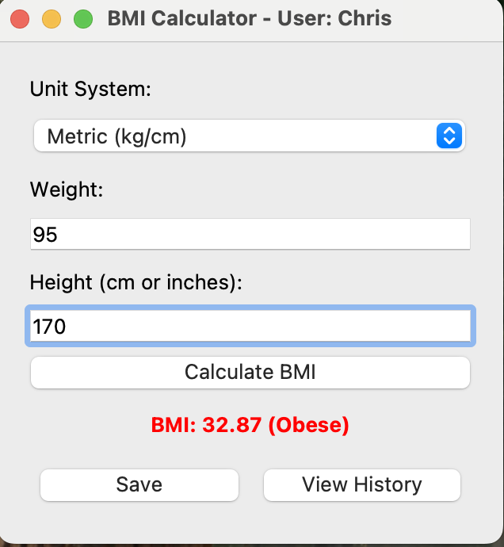
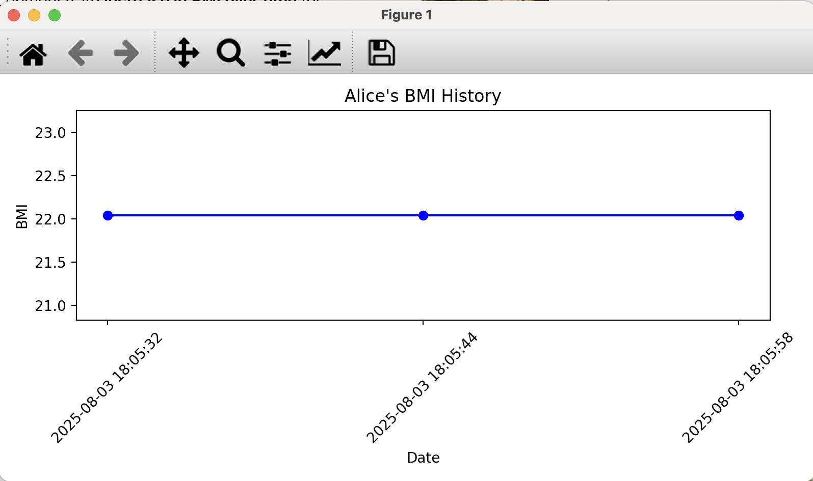

# 🧮 Advanced BMI Calculator GUI - Python

This project was completed as part of my **Python Programming Internship** at **Oasis Infobyte** (Project01). The objective of this task was to create an **Advanced BMI calculator with a GUI (Graphical User Interface)** that allows users to calculate, categorize, save, and visualize their Body Mass Index (BMI).

---

## 🚀 Live Demo

This is a Python-based desktop application, so there is no online demo available. You can download and run the code on your local machine using Python and PyQt5.

---

## 📌 Task Objective

Develop a **GUI-based Python application** that:

* Calculates Body Mass Index (BMI) using Metric or Imperial units.
* Categorizes the BMI (Underweight, Normal, Overweight, Obese).
* Displays result with category-specific color highlighting.
* Supports **login system** for multiple users.
* Stores historical BMI records in a local SQLite database.
* Visualizes BMI trends over time using a line chart.

---

## 🛠️ Technologies Used

* **Python 3**
* **PyQt5** - for GUI components
* **SQLite3** - for storing user login and BMI history
* **Matplotlib** - for data visualization (BMI trends)

---

## 📁 Project Structure

```

bmi\_calculator/
├── main.py                  # Entry point of the app (runs login + GUI)
├── gui/
│   ├── login\_window\.py      # Login window code
│   ├── bmi\_calculator.py    # BMI calculator window
│   └── styles.py            # (Optional) Style sheet for custom colors/themes     
├── data/
│   └── bmi\_data.db          # SQLite database file (auto-created)
├── requirements.txt         # Required Python packages
└── README.md                # Project overview and run instructions

````

---

## 🧾 Features

* **Login System**: Multiple users can log in with unique credentials.
* **Unit Selection**: Choose between Metric (kg, cm) or Imperial (lbs, inches).
* **BMI Categorization**: Shows results in different colors:
  - 🟠 Underweight
  - 🟢 Normal weight
  - 🟧 Overweight
  - 🔴 Obese
* **History Tracking**: Save BMI values per user.
* **Graph Visualization**: View BMI trends over time with a line plot.
* **Database Persistence**: All records are saved locally.

---

## 🖥️ How to Run

1. **Clone the Repository** (or download the ZIP file).

2. **Install the Requirements**:

   ````bash
   pip install -r requirements.txt


3. **Run the Application**:

   ```bash
   python main.py
   ```

4. The login window will open. Register a new user or log in to begin calculating BMI.

---

## 🖼️ Screenshot Placeholders

### 01 - Login Window



### 02 - BMI Calculator Window



### 03 - BMI Trend Graph



---

## 🔧 Future Enhancements

* Add password encryption for enhanced security.
* Add user profile pictures or custom avatars.
* Enable export of history to PDF or CSV.
* Add health recommendations based on BMI.
* Mobile version with Kivy or web version with Flask.

---

## 🎓 Internship & Task Details

* **Internship Track**: Python Programming
* **Internship Provider**: Oasis Infobyte
* **Project ID**: Project01
* **Task Name**: Advanced BMI Calculator GUI
* **Environment**: Python with PyQt5 GUI + SQLite + Matplotlib

---

## 📬 Contact

* **Name**: Difina George
* 📧 **Email**: [difina.georgecs@gmail.com](mailto:difina.georgecs@gmail.com)
* 📍 **Location**: Kerala, India
